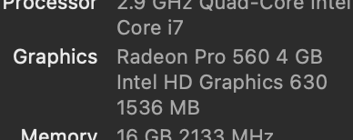
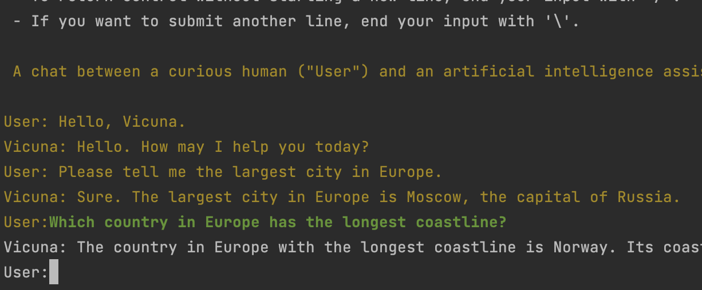

Working with Llama models
--------------------------

This is a guide on how to setup and use other LLMs with the system.  

For each model, I provide brief installation instructions for convenience. However, you should always refer to the 
original repository I link to for the most up-to-date instructions.

## Llama 2 and Llama-derivative models  

[LLaMA][2] is a Meta LLM that initially leaked and was then open-sourced as [Llama 2][4].  
It has become the base for a whole family of derivative, open-source models, like [Vicuna][1], a fine-tuned LLM for 
chat-like interactions.

### Requirements

* At least 10GB of CPU RAM for the 13B model
* Make
* Wget

### Installation

* Original instructions are [here][3].  
  Refer to them for the most up-to-date information.
* For speed optimisation, you need to decide which GPU library bindings to build with (`make` command).  
  Refer to the [LLaMA.cpp documentation][3] for more information on installing the dependent libraries.  
    
  In short, the mapping is:
  * NVidia GPU: cuBLAS `make -j LLAMA_CUBLAS=1`
  * AMD GPU: rocBLAS `make -j LLAMA_CLBLAST=1`
  * Intel GPU or Metal: `make -j LLAMA_METAL=1`
* The following one-liner will download >9Gb of data on your machine, so you will need a fast connection or some patience.

```bash
cd <somewhere_with_enough_space>
git clone https://github.com/fredi-python/llama.cpp.git \
  && cd llama.cpp \
  && make -j LLAMA_METAL=1 \
  && cd models \
  && wget -c https://huggingface.co/CRD716/ggml-vicuna-1.1-quantized/resolve/main/ggml-vicuna-13B-1.1-q5_1.bin
```

This command downloads the 5bit model, which is more accurate.  
You may wish to experiment with other models, trading size for accuracy.

Here is a small list of alternative Llama-compatible GGML models to get you started.   
They have various quantizations (i.e. accuracy and model size).  
* [Vicuna 13B 4bit](https://huggingface.co/CRD716/ggml-vicuna-1.1-quantized/resolve/main/ggml-vicuna-13B-1.1-q4_0.bin)
* [List of different Llama-2 models](https://huggingface.co/TheBloke/Llama-2-13B-chat-GGML/tree/main): Various sizes and accuracies

They are all interchangeable when it comes to code execution.

### Verifying Installation

Verify that the model is working and can respond by running the following command from the `llama.cpp` directory.  
This starts llama.cpp in interactive mode, using the downloaded model.  
```bash  
./main \
  -m models/ggml-vicuna-13B-1.1-q5_1.bin \
  --repeat_penalty 1.0 \
  --color -i \
  -r "User:" \
  -f prompts/chat-with-vicuna-v1.txt
```



If you have downloaded multiple models you can launch them separately and test the results with the same prompt.


   [1]: https://lmsys.org/blog/2023-03-30-vicuna/
   [2]: https://ai.facebook.com/blog/large-language-model-llama-meta-ai/
   [3]: https://github.com/vicuna-tools/vicuna-installation-guide/
   [4]: https://ai.meta.com/llama/