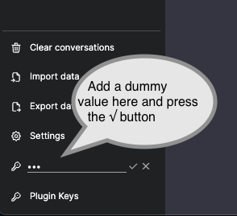

LLM Backend service
-------------------

## Description

This is the backend service for the LLM Chat UI demo project. 

The detailed description of each component of the project (and the tought-process behind the changes) can be found in 
the accompanying blog post in my [technical blog][5].

The service has been evolved in different branches (`v1`, `v2`, etc.), following the flow of the blog post.

## 1 minute overview

The idea behind this service is to provide an OpenAI-compatible RESTful API to a ChatGPT-compatible UI client. To achieve 
this it proxies a number of [OpenAI's chat API][1] endpoints.

The service is written in Python using [Connexion][3] and [SQLAlchemy][4].  
* Connexion: parse the OpenAI API specification (copied from their Github repo, with modified `operationId`s) to 
  automagically handle incoming HTTP requests,
* SQLAlchemy: an ORM to handle the database operations

## Requirements 

### Code 

* Make
* Python3
* pip3
* virtualenv

### Local integration environment

* Tilt
* Docker
* Local K8s cluster, set as default for your `kubectl` client (e.g. Docker Desktop with K8s enabled)

## Installation

After cloning the repository, create a virtual environment and install the dependencies.  
Before running, read the section on [custom models installation][9] and choose the right value for the flag 
before `pip install -r requirements.txt`.  
```bash
make install
```

Run the tests to confirm the installation. You will need to pass as env. variables:  
* a valid OpenAI API key
* an absolute path to a Llama-compatible model file.

See below for instructions on *Working with other models*. 

```bash
OPENAI_API_KEY=YOUR_OPENAI_KEY LLAMA_MODEL_FILE=/path/to/llama_file.bin make test
```

## Making code changes

After installation, before you make any code changes, activate the virtual environment.    
```bash
. venv/bin/activate  # On Windows, use `venv\Scripts\activate`
```

## Testing the system

The best way is to use the end-to-end environment provided by [Tilt][6].  
The environment is composed by the [chatbot-ui frontend][7] and the [llm-backend service][8], **checked out side-by-side on your machine**. 

After installing Tilt, from inside the `llm-backend` directory run `OPENAI_KEY_BASE64=<YOUR_OPENAI_API_KEY_IN_BASE64> tilt up`.  
This will start the service and the UI client.  
Then open your browser at `http://localhost:3000` to see the UI client.  
Add a dummy `OpenAI API key` in the corresponding bottom-left field to enable the interface.  


You can monitor the service logs from Tilt's UI at `http://localhost:10350/r/(Tiltfile)/overview`.
 
## Environment variables

| Environment Variable | Default value | Description                                                                                                                                                 |
|----------------------|---------------|-------------------------------------------------------------------------------------------------------------------------------------------------------------|
| LLAMA_MODEL_FILE     |               | Absolute path to the file location of the Llama-compatible model file. Model could be quantized (2, 3, 4,... bit). When set, enables the Llama controllers. |
| LLAMA_CONTEXT_SIZE   | `4096`        | Size of the Llama model input context window ("short-term memory") in tokens.                                                                               |
| OPENAI_API_KEY       |               | The default API key used for authentication with OpenAI. When set, enables the OpenAI controllers.                                                          |
| LOG_LEVEL            | `INFO`        | The logger's log level                                                                                                                                      |


## Working with other models

You can download and work with other models.  
The details for each supported type are below.

* [Llama-compatible models](./LLAMA_MODELS.md)


    [1]: https://github.com/openai/openai-openapi
    [2]: https://flask.palletsprojects.com/
    [3]: https://github.com/spec-first/connexion
    [4]: https://www.sqlalchemy.org/    
    [5]: https://sgerogia.github.io/???????
    [6]: https://tilt.dev/
    [7]: https://github.com/sgerogia/chatbot-ui
    [8]: https://github.com/sgerogia/llm-backend
    [9]: ./MODELS.md